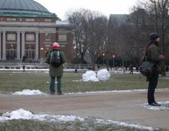
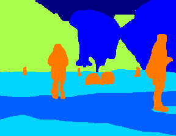

### A. Semantic Segmentation

 

In this problem, you will build your own semantic segmentation model on the
Stanford Background Dataset ([1](#references)). This task comprises of classifying
image pixels into the following 9 categories: sky, tree, road, grass, water,
building, mountain, foreground, misc. We will use the mean average precision
(on the soft output) and mean intersection over union (of the hard output) to
measure performance. We provide code for computing these metrics. For this assigment
you will need to prepare a PDF report, along with predictions using your model
to upload to gradescope.

#### Data
We have `572` images for training, `71` images for validation and `71` images
for testing. Each image is `288×224`. We provide a basic data loader that you
can build upon. Data can be downloaded from
[here](https://saurabhg.web.illinois.edu/teaching/ece598sg/fa2022/mps/mp1/sbd.tgz).
Download the file into the `data` folder, and zip it to obtain a folder
called `sbd`. It should have sub-folders `train`, `val` and `test` containing
images and ground truth labels.

#### Starter Code
We also provide a basic model (that trains a linear classifier on top of the
pixel value at each location), and also a training loop that shows how to use
pytorch for setting up training and validation.

#### What you need to do
1.  **Build on top of ImageNet pre-trained Model [10 pts]**: Your task is to build on top of a ResNet-18 ([4](#references)) model that has been
    pre-trained on the ImageNet dataset ([5](#references)) (via
    `models.resnet18(pretrained=True)`). These models are trained to predict the
    1000 ImageNet object classes. To use this model for semantic segmentation, you
    will have to remove the classifier and global average pooling layers, and stack
    on additional layers for semantic segmentation. Once again, refer to papers
    ([2,3](#references)) for inspiration on how you can build on top of such
    pre-existing models. You should experiment with at least two, if not more of the following:
    1. keeping the pretrained ResNet-18 model fixed vs finetuning it on the provided data
    2. number of layers in the decoder
    3. size (number of channels) of the layers in the decoder
    4. other training hyper-parameters (learning rate, batch size, optimizer)

    In your report, carefully document and report the major things you try, by noting the key architectural details, design rationale, and the impact on training plots and validation metrics. You should also include the relevant training plots and validation metrics. 

    For reference, our very basic first implementation of finetuned model is
    able to do 1 training epoch under 10s, and achieves a mAP of 0.62 and a mIoU of
    0.45 in under 20 minutes of training. At the very least your implementation
    should achieve as much accuracy on the validation set, but you may be able to
    do better with more training, and trying out alternate architectural choices.

2. **Test set perforamnce [5pts - autograded]**: The starter code produces predictions on the test set, writing to the file `MP1_sseg_predictions.npy`. After you have finished developing your model, generate predictions using the same code for evaluation against the ground truth labels. 
Upload the file `MP1_sseg_predictions.npy` to the MP1 assignemnt on gradescope to have it graded. Please upload the code for your final model as well. Make sure to include all autograded components from all components of MP1 for your final submission.

#### References
1. Stephen Gould, Richard Fulton, and Daphne Koller. Decomposing a scene into
geometric and semantically consistent regions. In ICCV 2009.
2. Olaf Ronneberger, Philipp Fischer, and Thomas Brox. U-net: Convolutional
networks for biomedical image segmentation. In MICCAI 2015.
3. Jonathan Long, Evan Shelhamer, and Trevor Darrell. Fully convolutional
networks for semantic segmentation. In CVPR 2015.
4. Kaiming He, Xiangyu Zhang, Shaoqing Ren, and Jian Sun. Deep residual
learning for image recognition. In CVPR 2016.
5. Jia Deng, Wwi Dong, Richard Socher, Li-Jia Li, Kai Li, and Li Fei-Fei. A
large-scale hierarchical image database. In CVPR 2009.
